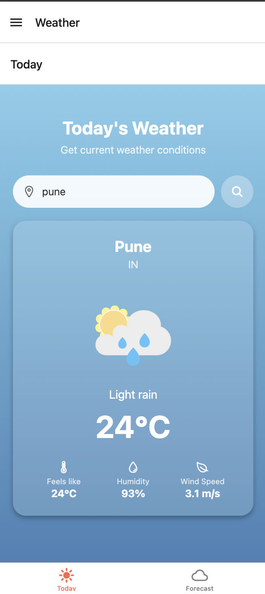
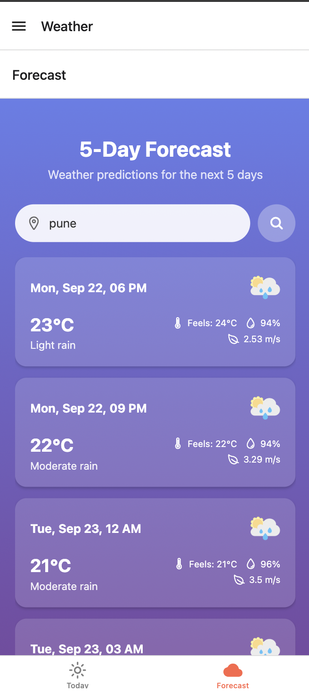

# Weather Mobile App 🌤️

A simple **React Native** weather app built with **Expo**. Shows real-time weather information and a **5-day forecast** for any city. Works on mobile and web.

---

## 🛠️ Tech Stack

- React Native + Expo  
- React Navigation (Drawer & Bottom Tabs)  
- React Native Web (for web support)  
- Expo Linear Gradient & React Native SVG  
- Hosted on Vercel (web demo)

---

## 🚀 Features

- Search for current weather by city  
- Displays temperature, weather conditions, wind speed, and humidity  
- View **5-day weather forecast**  
- Works on mobile (iOS/Android) and web  
- Clean, responsive UI with weather icons

---

## 💻 Run Locally

### 1. Clone the repo
```bash
git clone https://github.com/TechGenie-awake/weather-mobile-app.git
cd weather-mobile-app
```

### 2. Install dependencies
```bash
npm install
```

### 3. Run on mobile (Expo Go)
```bash
npx expo start
```

### 4. Run on web
```bash
npx expo start --web
```

---

## 🌐 Live Demo

[Weather App on Vercel](https://weather-mobile-qfdvstq2y-techgenie-awakes-projects.vercel.app/)

---

## 📂 Project Structure

```
/assets
  /icons
  /images
/screens
/components
/App.js
/package.json
/vercel.json
/README.md
```

---

## 📱 Screenshots

### Home Screen


### 5-Day Forecast


---
